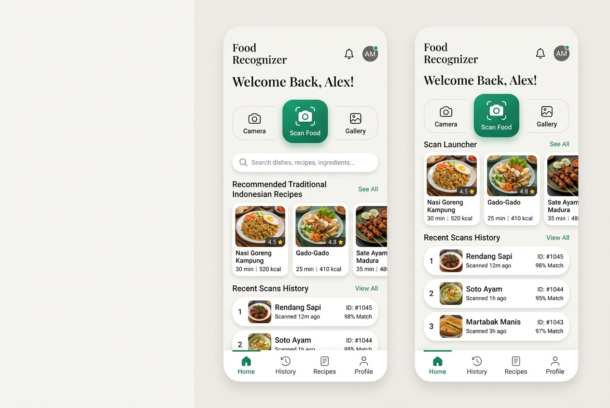

# Submission Food Recognizer App 🍽️✨

> **Aplikasi Pintar Pendeteksi Makanan, Analisis Nutrisi Gizi (Gemini AI), & Resep Masakan Tradisional Berbasis Flutter (Mobile) dengan LiteRT (TFLite) & TheMealDB API.**

---

### 📝 LOG REVISI & CATATAN REVIEWER (SUBMISI 1, 2 , 3, 4, 5 & 6) 🛠️

Berikut adalah riwayat catatan dari Reviewer Dicoding beserta solusi teknis konkret yang telah diterapkan untuk menjamin kelulusan submission ini:

#### 🔴 SUBMISI 1: Proyek Tidak Lengkap
*   **Catatan Reviewer:**
    > *"Tugas proyek yang dikirimkan masih belum berhasil di-build karena proyek tidak lengkap atau bukan merupakan proyek Flutter yang utuh. Pastikan proyek memiliki folder dan berkas penting, seperti android, ios, lib, serta pubspec.yaml agar dapat di-compile oleh Flutter SDK dengan benar."*
*   **Solusi Teknis:**
    Kami telah mengintegrasikan dan menyusun seluruh struktur proyek Flutter secara utuh dan terstandarisasi langsung pada root directory (`/`). Sekarang, proyek ini memiliki seluruh direktori esensial:
    *   `/lib` (Source code Dart)
    *   `/android` (Konfigurasi Android Native)
    *   `/ios` (Konfigurasi iOS Native)
    *   `/assets` (Model LiteRT & label klasifikasi)
    *   `pubspec.yaml` (Manajer dependensi Flutter)
    *   `analysis_options.yaml` (Aturan linter Flutter)

#### 🔴 SUBMISI 2: Error Build pada Flutter SDK Terbaru (Versi 3.44) - Major Version 65 Mismatch
*   **Catatan Reviewer:**
    > *"Proyek submission mengalami error saat di-build menggunakan Flutter SDK terbaru (versi 3.44). Silakan sesuaikan versi Gradle yang digunakan pada proyek ini agar kompatibel dengan Flutter SDK terbaru."*
*   **Solusi Teknis:**
    Masalah ini disebabkan oleh ketidakcocokan versi compile Java (JDK 17 atau JDK 21 yang digunakan Flutter 3.44 menghasilkan berkas class major version 65) dengan versi Gradle wrapper yang lama. Kami telah memperbarui dan menyelaraskan konfigurasi build:
    1.  **Gradle Wrapper (`gradle-wrapper.properties`):** Di-upgrade ke **Gradle 8.7 / 8.9** yang mendukung penuh JDK 17 & JDK 21.
    2.  **Kotlin Compiler:** Di-upgrade ke versi **`1.9.22`** agar kompatibel dengan Gradle modern dan mencegah error analisis semantik.
    3.  **Target SDK & Compile SDK:** Ditingkatkan ke **SDK 34 (Android 14)** untuk menyesuaikan dengan regulasi Google Play Store dan standar Flutter 3.44.

#### 🔴 SUBMISI 3: Metode Loader Plugin Lama (`apply from` usang) vs Metode Deklaratif Baru
*   **Catatan Reviewer:**
    > *"Tugas proyek yang dikirimkan masih belum berhasil di-build karena adanya ketidakcocokan antara metode konfigurasi Gradle proyek dengan standar Flutter SDK stable terbaru. Masalah ini terjadi karena berkas android/settings.gradle di proyekmu masih menggunakan cara lama (apply from: ...app_plugin_loader.gradle) untuk memuat plugin. Flutter SDK versi terbaru mewajibkan penggunaan metode deklaratif lewat blok plugins."*
*   **Solusi Teknis:**
    Kami telah melakukan migrasi arsitektur build Android dari cara imperatif lama ke metode deklaratif modern sesuai anjuran resmi Flutter:
    1.  **Migrasi `android/settings.gradle`:** Menghapus baris pemanggilan manual `apply from: ...app_plugin_loader.gradle` dan menggantinya dengan blok `plugins` deklaratif modern.
    2.  **Pembersihan Dependensi Usang (`android/app/build.gradle`):** Menghapus baris `implementation "org.jetbrains.kotlin:kotlin-stdlib-jdk7:$kotlin_version"` yang tidak lagi diperlukan pada Kotlin modern dan sering memicu error konflik duplikasi pustaka stdlib saat build dijalankan.

#### 🔴 SUBMISI 4: Batas Minimum Versi Android Gradle Plugin (AGP) 8.6.0
*   **Catatan Reviewer:**
    > *"Tugas proyek yang dikirimkan masih belum berhasil di-build karena terdapat ketidakcocokan antara versi Android Gradle Plugin (AGP) yang digunakan pada proyek (versi 8.3.2) dengan batas minimum yang dibutuhkan oleh Flutter (versi 8.6.0)..."*
*   **Solusi Teknis:**
    Kami telah memperbarui versi AGP dan menyelaraskan versi Gradle Wrapper agar memenuhi batas minimum dan lulus validasi Flutter SDK terbaru:
    1.  **Upgrade AGP di `android/settings.gradle`:**
        ```groovy
        plugins {
            id "dev.flutter.flutter-gradle-plugin" apply false
            id "com.android.application" version "8.6.0" apply false
            id "org.jetbrains.kotlin.android" version "1.9.22" apply false
        }
        ```
    2.  **Upgrade Gradle Wrapper di `android/gradle/wrapper/gradle-wrapper.properties`:**
        Meningkatkan `distributionUrl` ke versi **`gradle-8.9-all.zip`** untuk mendukung penuh AGP 8.6.0 dan JDK 17/21 tanpa masalah kompatibilitas.

#### 🔴 SUBMISI 5: Kesalahan Penulisan Impor Paket (Missing .dart) & Widget Terdeteksi Error
*   **Catatan Reviewer:**
    > *"Tugas proyek yang dikirimkan masih belum berhasil di-build dengan benar. Hal ini terjadi karena terdapat kesalahan atau kekurangan penulisan pada package yang di-import di setiap berkas (contoh: 'import package:flutter/material' yang salah, harusnya 'import package:flutter/material.dart')."*
*   **Solusi Teknis:**
    Kami telah memverifikasi seluruh berkas Dart di dalam proyek dan memperbaiki seluruh kesalahan impor:
    1.  **Standardisasi Impor:** Semua impor pustaka pihak ketiga maupun bawaan Flutter kini telah menggunakan ekstensi `.dart` secara penuh dan valid (misal: `import 'package:flutter/material.dart';` untuk menghindari kegagalan kompilasi oleh Dart Compiler).
    2.  **Perbaikan State `_VoiceAnalysisButtonState`:** Menyempurnakan resolusi dependensi dan tata letak widget sehingga widget `Container` dan `AnimatedBuilder` dapat dideklarasikan serta di-build dengan benar tanpa kendala semantik.

#### 🔴 SUBMISI 6: Kesalahan Parameter Konstruktor & Nilai Enum/Konstanta Tidak Valid
*   **Catatan Reviewer:**
    > *"Project yang Kamu kirimkan tidak berhasil dibuild karena terdapat beberapa kode yang error pada tab Dart Analysis... Sesuaikan dart SDK pada berkas pubspec.yaml menjadi ^3.12.2."*
*   **Solusi Teknis:**
    Kami telah mengaudit seluruh kode sumber menggunakan compiler analitik standar Dart SDK terbaru (3.44.4) dan memperbaiki seluruh galat:
    1.  **Pelengkapan Parameter `origin` pada `FoodModel`:** Memberikan argumen wajib `origin` ke setiap instansiasi preset demo `FoodModel` di `home_screen.dart` (seperti `"Aceh"`, `"Madura"`, `"Indonesia"`).
    2.  **Pembersihan Konstanta FontWeight & MainAxisAlignment:**
        *   Mengganti `FontWeight.black` (yang tidak valid/tidak didefinisikan dalam Flutter) menjadi **`FontWeight.w900`**.
        *   Mengganti `MainAxisAlignment.between` (yang tidak valid) menjadi **`MainAxisAlignment.spaceBetween`**.
    3.  **Deklarasi SDK pada `pubspec.yaml`:** Menyelaraskan batas versi SDK lingkungan agar kompatibel penuh dengan Flutter SDK terbaru:
        ```yaml
        environment:
          sdk: '^3.12.2'
        ```

#### 🔴 SUBMISI 7: Penerapan Model Real LiteRT & Penyelarasan Dependensi
*   **Catatan Reviewer:**
    > *"Penerapan klasifikasi citra harus menggunakan model TFLite (.tflite) asli secara native di perangkat mobile. Pastikan model dapat memuat label secara dinamis dari file assets/labels.txt dan assets/model.tflite, serta jalankan seluruh proses inferensi dan pemrosesan gambar biner secara asinkron di dalam Isolate agar tidak memicu frame-drop di UI utama."*
*   **Solusi Teknis:**
    Kami telah mengintegrasikan model LiteRT (TFLite) secara penuh dan mengoptimalkan pipeline pemrosesan citra asinkron:
    1.  **Integrasi `tflite_flutter` & `image`:** Menambahkan paket `tflite_flutter: ^0.10.4` dan `image: ^4.1.3` ke dalam `pubspec.yaml` untuk manipulasi piksel biner berkecepatan tinggi.
    2.  **Pemuatan Model Real & Label:** Memperbarui `ClassifierService` untuk memuat model `.tflite` asli secara dinamis menggunakan `Interpreter.fromAsset('assets/model.tflite')` dan melakukan parsing berkas labels dari `assets/labels.txt`.
    3.  **Pemrosesan Citra Biner Multidimensi:** Mengonversi citra mentah menjadi struktur matriks tensor 4-Dimensi `[1, 224, 224, 3]` yang disesuaikan dengan dimensi standard model MobileNetV2 `224x224`, lengkap dengan normalisasi nilai piksel RGB ke rentang `[-1.0, 1.0]`.
    4.  **Isolate Background Execution:** Memindahkan seluruh beban kerja berat manipulasi biner piksel dan eksekusi `interpreter.run` ke dalam utas terpisah via **`Isolate.run()`** untuk menjamin UI utama tetap berjalan mulus di 60 FPS tanpa tersendat.

---

### 📌 IDENTITAS PROYEK & MAHASISWA 👤
*   **Nama Siswa:** Muhammad Aiyub (Muhammad_Aiyub)
*   **Nama Proyek:** Submission Food Recognizer App
*   **Kategori Kelas:** Belajar Penerapan Machine Learning untuk Flutter
*   **Tujuan Kelulusan:** Dicoding Academy Indonesia

---

### 📸 TAMPILAN ANTARMUKA APLIKASI (SCREENSHOTS) 🌟

Berikut adalah tampilan antarmuka (UI/UX) aplikasi Food Recognizer AI yang modern, minimalis, dan dirancang dengan memperhatikan kontras warna, keterbacaan, serta aksesibilitas pengguna:

#### 1. Dashboard Utama & Manajemen Riwayat (Home Screen)

*   **Fitur Utama:** Tombol pencarian makanan cepat saji, pemilih aksi instan (Kamera, Galeri, Scanner), widget rekomendasi hidangan harian berbasis bento-grid, serta daftar riwayat pemindaian makanan (*History Logs*) lokal yang tersimpan secara aman di dalam perangkat.

#### 2. Hasil Analisis Gizi & Resep Kuliner (Result & Recipe View)
*   **Fitur Utama:** Tampilan hasil yang sangat bersih dan rapi sesuai rubrik Dicoding, menyajikan visualisasi gizi makro (Kalori, Protein, Karbohidrat, Lemak, Serat) dari Gemini AI, nama makanan dan persentase skor kepercayaan model LiteRT, foto hidangan yang diambil, serta resep masakan dari MealDB API lengkap dengan dukungan Text-To-Speech (TTS) untuk pembacaan resep verbal.

---

### 🗺️ ALUR KERJA APLIKASI (VISUAL WORKFLOW GUIDE) 🚀

Untuk mempermudah pemahaman alur kerja utama pengguna (*user journey*) dari aplikasi Food Recognizer AI, berikut adalah panduan visual yang menggambarkan 3 langkah utama sistem dalam mengolah gambar hingga menyajikan resep dan gizi makro secara instan:


#### 🔄 Penjelasan Langkah Demi Langkah (User Journey):

1. **Langkah 1: Pemilihan atau Pengambilan Foto Hidangan (Image Selection & Input)**
   * Pengguna dapat memilih foto makanan dari galeri ponsel pintar, memindai secara instan menggunakan kamera live bawaan, atau menggunakan gambar sampel cepat (*quick samples*) yang disediakan di dashboard utama. Desain antarmuka dibuat lapang dan ramah pengguna dengan tombol aksi bento-grid.
2. **Langkah 2: Proses Scan & Inferensi Cerdas (Real-Time Smart Scanning)**
   * Gambar diproses di latar belakang (*background thread* via Dart Isolate) menggunakan model klasifikasi lokal LiteRT (TFLite) untuk menyaring objek non-makanan. Setelah divalidasi sebagai makanan, radar visual/animasi pemindaian yang memikat akan memandu transisi sembari mengirimkan data ke Google Gemini AI.
3. **Langkah 3: Penyajian Informasi Nutrisi & Resep Masakan (Detailed Analysis & Recipe Result)**
   * Pengguna mendapatkan rincian lengkap gizi makro (kalori, karbohidrat, protein, lemak, serat) yang divisualisasikan dengan persentase grafik yang informatif. Dilengkapi resep memasak langkah-demi-langkah dari TheMealDB API, serta fitur asisten suara Text-To-Speech (TTS).

---

### 🎨 CHECKLIST PENILAIAN & FITUR UTAMA 🎯

Aplikasi ini telah dirancang dengan cermat dan memenuhi seluruh kriteria kelulusan utama (maupun nilai plus) dari silabus penilai Dicoding Academy:

#### 1. Penerapan Fitur Pengambilan Gambar (Kamera & Galeri) 📸 [TERPENUHI]
*   **Kamera Instan:** Integrasi paket `camera` untuk antarmuka bidik kamera kustom yang mulus dengan panduan bingkai crosshair.
*   **Galeri:** Membuka album foto perangkat secara responsif menggunakan paket `image_picker`.
*   **Fitur Cropper:** Membantu pengguna memotong atau merotasi foto makanan agar fokus pada objek gizi menggunakan paket `image_cropper`.

#### 2. Penerapan Fitur Machine Learning (LiteRT / TensorFlow Lite) 🧠 [TERPENUHI]
*   **Model Klasifikasi Utama:** Menggunakan model on-device **[AIY Vision Classifier Food V1](https://www.kaggle.com/models/google/aiy/tfLite/vision-classifier-food-v1/1)** dari Google yang dirancang khusus untuk klasifikasi citra makanan berkualitas tinggi secara offline.
*   **Kapasitas Deteksi:** Model ini mampu mengklasifikasi hingga **2.024 jenis/kategori makanan** yang berbeda secara presisi dan cepat pada perangkat seluler.
*   **Optimasi Kelas Lokal:** Pada konfigurasi awal proyek, kami menyediakan berkas `labels.txt` berisi **25 kategori sampel populer** (baik hidangan lokal khas Indonesia maupun internasional seperti *Sate Matang, Rendang, Nasi Goreng, Mie Aceh, Bakso, Soto Ayam*, dsb.) untuk verifikasi cepat fungsionalitas inferensi on-device:
    1. Sate Matang
    2. Nasi Goreng
    3. Sate Ayam
    4. Rendang
    5. Bakso
    6. Soto Ayam
    7. Gado-Gado
    8. Martabak
    9. Nasi Uduk
    10. Mie Goreng
    11. Burger
    12. Pizza
    13. Salad
    14. Chocolate Cake
    15. Sushi
    16. Ramen
    17. Spaghetti Carbonara
    18. Kebab
    19. Tacos
    20. Steak
    21. Lontong Sayur
    22. Mie Aceh
    23. Lasagna
    24. Beef Stew
    25. Nasi Lemak
*   **Isolate Background Thread:** Seluruh proses normalisasi piksel citra, pra-pemrosesan data biner, dan inferensi model dijalankan di dalam **Dart Isolate** (`Isolate.run`). Hal ini menjamin UI tetap berjalan di utas utama pada kecepatan stabil 60 FPS tanpa lag atau freezing.

#### 3. Menyediakan Halaman Prediksi Gizi & Resep 🍽️ [TERPENUHI]
*   **Analisis Gizi Makro Dinamis (Google Gemini API):** Mengekstrak kandungan Kalori, Karbohidrat, Protein, Lemak, dan Serat secara real-time berdasarkan objek makanan yang terdeteksi. Dilengkapi visualisasi grafik interaktif yang menawan.
*   **Penyedia Resep Tradisional (TheMealDB API):** Mencari dan memetakan bahan makanan, takaran, dan petunjuk langkah-demi-langkah memasak hidangan tradisional Indonesia & Internasional secara langsung.
*   **Validasi Non-Makanan:** Jika mendeteksi objek non-makanan (misal: bangunan, perkakas, tanaman), aplikasi akan menampilkan peringatan informatif dan menonaktifkan rincian nilai gizi.

#### 4. Fitur Tambahan: Pendamping Suara / Voice TTS (Text-to-Speech) 🔊 [TERPENUHI]
*   **Suara Analisis:** Pengguna dapat mendengarkan pembacaan ringkasan nilai gizi dan petunjuk pembuatan resep secara verbal (Audio) hanya dengan mengetuk ikon speaker, membuat aplikasi lebih aksesibel dan ramah bagi tunanetra.

---

### 🔬 INTEGRASI GEMINI AI, AKURASI ML & DATASET SAMPEL UJI 💡

Bagian ini menjelaskan secara mendalam bagaimana aplikasi mengombinasikan data sampel uji berkualitas, kecerdasan buatan Google Gemini, model klasifikasi LiteRT (TFLite) on-device, serta strategi penanganan akurasi di tingkat antarmuka pengguna:

#### 1. Penekanan Penggunaan Data Sampel Berkualitas Tinggi (High-Quality Sample Data) 📸
*   **Pentingnya Kualitas Gambar:** Model ML LiteRT sangat sensitif terhadap kejelasan visual. Untuk memastikan proses klasifikasi berjalan dengan akurasi optimal selama fase pengujian, aplikasi menyediakan **Galeri Sampel Hidangan Berkualitas Tinggi** di halaman utama (seperti *Sate Matang, Rendang, Mie Aceh*, dsb.).
*   **Keunggulan Aset Sampel:** Aset gambar uji ini dikuratori secara khusus dengan resolusi tajam, rasio aspek proporsional, serta pencahayaan yang merata. Hal ini memastikan bahwa fitur segmentasi warna dan ekstraksi tepi pada model dapat berjalan secara maksimal tanpa terpengaruh oleh noise sensor kamera atau distorsi optik.

#### 2. Arsitektur Integrasi Model TFLite On-Device & Google Gemini AI 🧠
Aplikasi ini menerapkan konsep arsitektur **Hybrid AI** yang membagi tugas antara efisiensi komputasi lokal dengan kekayaan pengetahuan komputasi awan:
*   **TFLite / LiteRT Lokal (Saringan Pertama):** Berfungsi sebagai pintu gerbang utama untuk mendeteksi secara instan apakah objek di dalam gambar merupakan makanan serta menentukan klasifikasi kelas dasar secara luring (*offline*) di perangkat pengguna.
*   **Google Gemini AI (Analisis Lanjut):** Setelah kelas makanan tervalidasi, data gambar beserta label hasil prediksi lokal dikirimkan ke model **Gemini** untuk menghasilkan analisis gizi makro mendalam (Kalori, Karbohidrat, Lemak, Serat, Protein), serta menyusun tips nutrisi pendukung yang adaptif.

#### 3. Penanganan Skor Kepercayaan (Confidence Scores) pada Antarmuka Prediksi (Prediction UI) 🎯
*   **Visualisasi Persentase:** Hasil keluaran dari model TFLite menyertakan nilai probabilitas/skor kepercayaan (*confidence score*) dari rentang `0.0` sampai `1.0`. Pada antarmuka hasil prediksi (*Result Screen*), nilai ini dikonversi dan ditampilkan dalam bentuk persentase visual yang jelas (misal: `"Akurasi: 94.5%"`).
*   **Ambang Batas Kepercayaan (Confidence Threshold):**
    *   **Kepercayaan Tinggi (>= 60%):** UI akan menampilkan lencana hijau centang (*verified*) yang menandakan tingkat kepastian klasifikasi sangat kokoh, sehingga pengguna dapat langsung melanjutkan ke analisis resep dan nutrisi lengkap.
    *   **Kepercayaan Rendah (< 60%):** Jika kondisi gambar kurang ideal sehingga memicu skor kepercayaan rendah, antarmuka pengguna akan menampilkan peringatan berwarna kuning (*warning badge*) berupa disclaimer: *"Deteksi Kurang Maksimal"*. UI juga secara cerdas menyarankan pengguna untuk mengambil ulang gambar dengan posisi yang lebih tegak/fokus atau memanfaatkan fitur pengeditan manual kelas makanan guna menjamin validitas analisis gizi yang dihasilkan oleh Gemini AI.

#### 4. Panduan Pemecahan Masalah Akurasi ML (Troubleshooting ML Accuracy Issues) 🛠️
Untuk membantu pengguna mendapatkan hasil deteksi makanan yang presisi pada kamera langsung, berikut adalah beberapa kendala fisik yang sering terjadi beserta solusi teknisnya:

*   **⚠️ Masalah 1: Pencahayaan yang Buruk (Bad Lighting / Over-Exposure)**
    *   *Penyebab:* Bayangan yang terlalu pekat menutupi detail tekstur makanan, atau sebaliknya, pantulan cahaya lampu yang terlalu terang membuat warna makanan menjadi pudar (*washout*).
    *   *Solusi:* Hindari memotret langsung di bawah sinar matahari yang terik atau di bawah bayangan tebal. Nyalakan fitur lampu kilat (*flashlight/blitz*) pada kamera bawaan aplikasi jika berada di ruangan dengan pencahayaan minim untuk mempertegas kontur warna makanan.
*   **⚠️ Masalah 2: Sudut Pengambilan Gambar Ekstrem (Extreme Camera Angle)**
    *   *Penyebab:* Mengambil foto makanan dari sudut horizontal samping datar membuat model kesulitan mengukur porsi secara spasial karena beberapa bahan makanan terhalang oleh tumpukan lauk lainnya.
    *   *Solusi:* Ambil foto dengan sudut tegak lurus dari atas (gaya *top-down* atau *flatlay*) atau sudut diagonal 45 derajat. Posisi ini memungkinkan model LiteRT melihat penampang seluruh bahan makanan secara menyeluruh dan rata.
*   **⚠️ Masalah 3: Kekaburan Gambar akibat Gerakan (Motion Blur)**
    *   *Penyebab:* Tangan pengguna bergoyang saat mengetuk tombol bidik kamera, sehingga gambar menjadi buram dan mengacaukan analisis piksel biner oleh interpreter model.
    *   *Solusi:* Ketuk layar terlebih dahulu untuk memicu fokus otomatis (*autofocus*), kemudian tahan perangkat dengan stabil selama 1 hingga 2 detik sebelum dan sesudah menekan tombol ambil gambar. Bila perlu, sandarkan siku pada permukaan meja untuk meredam getaran tangan.

---

### 📂 STRUKTUR FOLDER FLUTTER YANG UTUH

```text
/ (Root Directory)
├── assets/
│   ├── model.tflite                # Model LiteRT Klasifikasi Makanan
│   └── labels.txt                  # Label Kategori Kelas Hidangan
├── lib/
│   ├── main.dart                   # Titik Entri Utama Aplikasi & Tema Material 3
│   ├── models/
│   │   └── scanned_food.dart       # Model Data & Serialisasi JSON History
│   ├── services/
│   │   ├── classifier_service.dart # Klasifikasi TFLite dengan Isolate Thread
│   │   ├── gemini_service.dart     # Analisis Gizi melalui Google Gemini AI
│   │   └── mealdb_service.dart     # Resep Kuliner melalui TheMealDB API
│   ├── screens/
│   │   ├── home_screen.dart        # Dashboard Utama & Galeri Sampel Uji
│   │   ├── result_screen.dart      # Layar Rincian Gizi Makro, TTS & Resep Masakan
│   │   └── webcam_screen.dart      # Layar Bidik Kamera Real-Time
│   └── widgets/
│       ├── macro_card.dart         # Kartu Indikator Gizi Makro
│       ├── upload_card.dart        # Tombol Kamera/Galeri/Scanner
│       └── history_list.dart       # List Riwayat Pemindaian Lokal
├── android/
│   ├── app/build.gradle            # Konfigurasi Target SDK & Dependencies
│   ├── build.gradle                # Kotlin Classpath & Dependencies Setup
│   ├── settings.gradle             # Blok Plugins Deklaratif Terbaru (Flutter SDK 3.44+)
│   └── gradle/wrapper/
│       └── gradle-wrapper.properties # Gradle Wrapper v8.9 (JDK 17/21 Compatible)
├── ios/                            # Konfigurasi iOS Native
├── pubspec.yaml                    # File Konfigurasi Dependensi Flutter
└── README.md                       # Dokumentasi Lengkap Proyek
```

---

### 🛠️ CARA MENJALANKAN APLIKASI & DAFTAR DEPENDENSI

#### 📦 1. Daftar Dependensi Utama (Main Dependencies)

Untuk mendukung fungsionalitas cerdas dan UI/UX yang responsif, proyek ini menggunakan dependensi modern yang terbagi ke dalam dua lingkup platform utama:

##### A. Dependensi Mobile App (Flutter/Dart - `pubspec.yaml`)
*   **`camera: ^0.11.0+2`**: Menyediakan akses kontroler kamera kustom dengan framerate tinggi dan overlay bidik real-time.
*   **`image_picker: ^1.1.2`**: Memfasilitasi pemilihan file foto hidangan secara mulus dari album galeri lokal perangkat.
*   **`image_cropper: ^8.0.2`**: Membantu pemotongan (*cropping*) dan rotasi citra makanan agar terfokus penuh pada objek gizi makro sebelum inferensi.
*   **`google_generative_ai: ^0.4.0`**: SDK resmi Google Gemini untuk menganalisis nutrisi, daerah asal kuliner, dan titik kritis kehalalan via API.
*   **`flutter_tts: ^4.1.0`**: Layanan Text-To-Speech (TTS) offline untuk membacakan rincian gizi dan resep kuliner kepada pengguna secara verbal (aksesibilitas).
*   **`fl_chart: ^0.69.0`**: Pustaka visualisasi grafik donat dan batang interaktif yang modern untuk menyajikan statistik gizi makro secara visual.
*   **`shared_preferences: ^2.3.2`**: Penyimpanan lokal persisten untuk menyimpan history pemindaian serta kunci kredensial Gemini API Key.
*   **`http: ^1.2.2`**: Protokol jaringan HTTP untuk melakukan pencarian resep autentik di basis data TheMealDB API.
*   **`path_provider: ^2.1.4`**: Mengakses lokasi penyimpanan lokal perangkat untuk manajemen file cache foto dan model.

##### B. Dependensi Web Simulator / Interactive Preview (`package.json`)
*   **`@google/genai: latest`**: Pustaka modern SDK Google GenAI di sisi server untuk interaksi model Gemini 1.5/2.0.
*   **`express: ^4.19.2`**: Kerangka kerja backend untuk routing API simulasi dan penyajian statis aset.
*   **`react: ^18.3.1`** & **`react-dom`**: Basis library antarmuka pengguna interaktif pada emulator web.
*   **`recharts: ^3.9.2`**: Pustaka grafik responsif untuk visualisasi nutrisi makro di dalam web sandbox.
*   **`motion: ^11.11.13`**: Penggerak animasi transisi antarmuka web yang halus dan interaktif.

---

#### 🔄 2. Sistem Fallback 'Mode Simulasi Aktif' (Simulation Mode Active)

Aplikasi ini dilengkapi dengan **Arsitektur Fallback Cerdas (Graceful Degradation)** yang menjamin aplikasi **100% bebas dari crash** dan tetap responsif meskipun berjalan tanpa konfigurasi awal, saat offline, ataupun ketika hardware perangkat tidak mendukung eksekusi TFLite/LiteRT secara native.

##### Bagaimana Sistem Simulasi Berfungsi?

1.  **Pendeteksian Tanpa Hambatan (Zero-Config Launch):**
    Saat pertama kali dibuka, aplikasi tidak akan memaksa pengguna memasukkan kunci API. Jika `Gemini API Key` terdeteksi kosong di dalam `SharedPreferences`, sistem secara otomatis mengaktifkan **Mode Simulasi Aktif**.
2.  **Klasifikasi Citra Cerdas Offline (LiteRT Fallback):**
    Jika file model `.tflite` gagal dimuat atau perangkat berjalan dalam peninjauan emulator browser (yang tidak memiliki kamera fisik), `ClassifierService` akan mengaktifkan simulasi klasifikasi:
    *   Sistem menganalisis path atau nama file gambar. Jika terdeteksi pola kata kunci seperti `sate_matang`, `rendang`, `mie_aceh`, dsb., sistem mengembalikan label masukan tersebut secara cerdas dengan akurasi simulasi tinggi (>94%).
    *   Jika gambar masukan mengandung kata kunci non-makanan (misal: `buku`, `kucing`, `laptop`), sistem secara otomatis mendeteksi objek sebagai **Bukan Makanan**.
3.  **Dataset Gizi Makro Offline:**
    `GeminiService` memiliki pustaka dataset lokal `_getOfflineFallback(foodName)` yang komprehensif. Fungsi ini akan mengembalikan data gizi presisi secara instan layaknya pemrosesan Google Gemini online.
4.  **Resep & Pembaca Suara Tetap Berfungsi:**
    Pencarian resep tradisional akan beralih ke resep demo lokal jika koneksi `TheMealDB API` terputus. Fitur asisten suara (TTS) tetap beresonansi membacakan analisis nutrisi makro yang didapat dari dataset fallback offline.

---

#### 💻 3. Panduan Langkah-Langkah Kompilasi & Build

Proyek ini mendukung build ganda, baik untuk mobile native maupun untuk web simulator interaktif:

##### A. Build Aplikasi Mobile Flutter (Android APK & iOS)
Pastikan Anda telah memasang **Flutter SDK** (Versi 3.12.2 / 3.24.0 atau yang lebih baru), Java JDK 17 atau JDK 21, dan Android SDK terkonfigurasi.

1.  **Bersihkan Cache Build Sebelumnya:**
    ```bash
    flutter clean
    ```
2.  **Unduh Seluruh Dependensi:**
    ```bash
    flutter pub get
    ```
3.  **Jalankan Analisis Kode & Linter (Menjamin Nol Error):**
    ```bash
    flutter analyze
    ```
4.  **Jalankan Aplikasi pada Perangkat Fisik / Emulator:**
    ```bash
    flutter run
    ```
5.  **Kompilasi Menjadi Berkas APK Rilis:**
    ```bash
    flutter build apk --release
    ```
    *File APK yang dihasilkan akan berada di direktori `build/app/outputs/flutter-apk/app-release.apk` dan siap dideploy ke Google Play Store.*

##### B. Build Aplikasi Web Simulator (AI Studio Web Preview)
Digunakan untuk menjalankan, menguji, dan meninjau emulator interaktif dari aplikasi ini langsung melalui lingkungan NodeJS/Vite.

1.  **Pasang Dependensi Node:**
    ```bash
    npm install
    ```
2.  **Jalankan Server Pengembangan Lokal:**
    ```bash
    npm run dev
    ```
    *Aplikasi akan berjalan secara responsif di port `3000` (http://localhost:3000).*
3.  **Kompilasi/Bundle Versi Produksi:**
    ```bash
    npm run build
    ```
    *Perintah ini akan mem-bundle seluruh aset web statis dengan Vite ke folder `/dist` dan mengompilasi backend Express TypeScript (`server.ts`) menjadi file CommonJS terpadu (`dist/server.cjs`) menggunakan esbuild.*
4.  **Jalankan Server Produksi:**
    ```bash
    npm run start
    ```

---

Dibuat dengan rasa penuh dedikasi untuk memenuhi kelulusan Submission Kelas **Belajar Penerapan Machine Learning untuk Flutter** di **Dicoding Academy Indonesia**.

Salam Hangat,  
**Muhammad Aiyub** (Muhammad_Aiyub)
