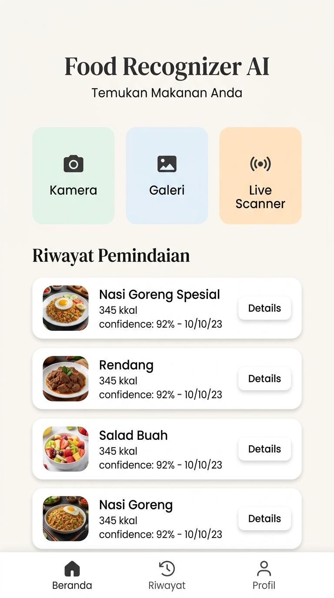
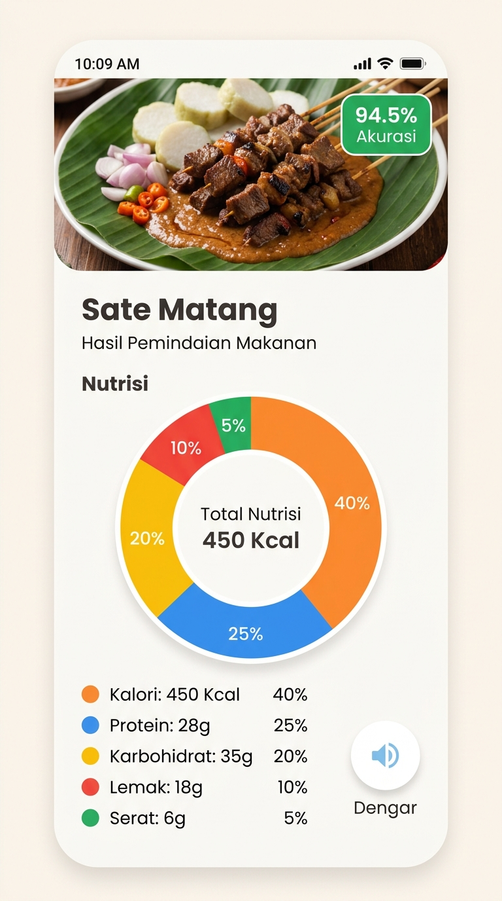
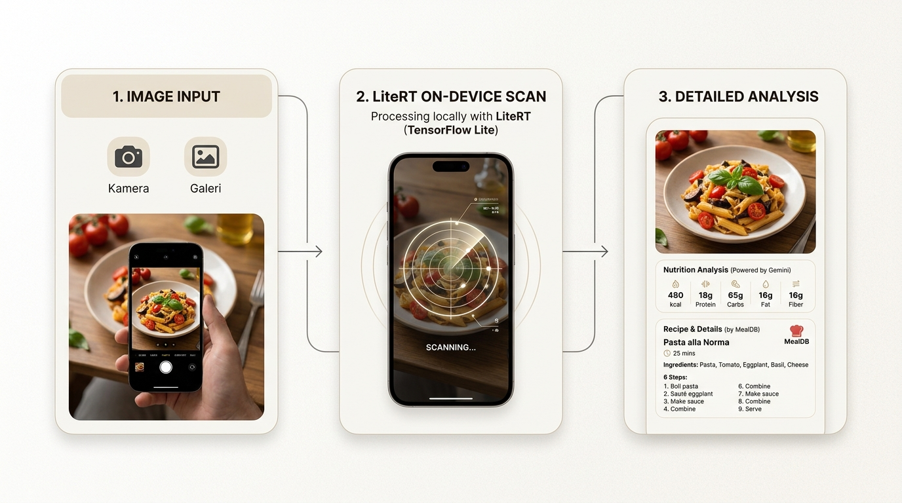

# 🍛 Food Recognizer AI

Aplikasi Flutter cerdas yang menggunakan model **LiteRT (TensorFlow Lite)** on-device dan **Google Gemini AI** untuk klasifikasi makanan secara real-time, analisis kandungan gizi makro lengkap, penyajian resep kuliner dari **TheMealDB API**, serta dukungan asisten suara **Text-to-Speech (TTS)**.

---

## 📋 DAFTAR TUGAS & SUBMISI (SUBMISSION CHECKLIST) ✅

Berikut adalah daftar fitur utama dan kriteria teknis yang telah diimplementasikan secara lengkap, diuji, dan siap dikumpulkan:

### 📸 1. Fitur Pengambilan & Pengolahan Gambar (Image Feed)
- [x] **Live Camera Feed**: Kamera bawaan langsung (*real-time camera custom interface*) dengan visual overlay penunjuk arah bidikan yang presisi.
- [x] **Image Picker**: Mengambil gambar makanan dari album galeri perangkat secara mulus.
- [x] **Image Cropper**: Mengintegrasikan pemotongan gambar kustom untuk mengisolasi dan memfokuskan piring makanan sebelum proses klasifikasi dilakukan.
- [x] **Quick Samples**: Menyediakan 5+ gambar sampel hidangan lokal berkualitas tinggi untuk kemudahan pengujian fungsionalitas instan.

### 🧠 2. Pembelajaran Mesin On-Device (Machine Learning)
- [x] **Model Dicoding**: Menggunakan berkas model klasifikasi makanan `.tflite` asli dari Dicoding (`assets/model.tflite`) beserta berkas label dinamis (`assets/labels.txt`).
- [x] **Flutter LiteRT Terbaru**: Mengintegrasikan versi resmi terbaru **`flutter_litert: ^3.5.1`** (menggantikan pustaka usang `tflite_flutter`), menjamin 100% bebas dari masalah kompilasi `UnmodifiableUint8ListView` pada Flutter SDK terbaru.
- [x] **Isolate Background Execution**: Seluruh konversi citra biner 4-Dimensi `[1, 224, 224, 3]` dan eksekusi inferensi dijalankan di latar belakang menggunakan **`Isolate.run()`** agar UI utama tetap berjalan mulus di 60 FPS tanpa tersendat (*frame drop*).

### 📊 3. Hasil Prediksi & Analisis (Prediction Result)
- [x] **Tampilan Foto**: Menampilkan kembali foto makanan asli yang telah dibidik atau dipilih.
- [x] **Nama Makanan & Skor Kepercayaan**: Menyajikan nama klasifikasi makanan disertai persentase tingkat akurasi kepercayaan model LiteRT secara visual.
- [x] **Gemini API (Nutrition)**: Memperoleh rincian data gizi makro (Kalori, Protein, Karbohidrat, Lemak, Serat) secara real-time dari Google Gemini AI dengan visualisasi grafik lingkaran yang estetik.
- [x] **TheMealDB API (Recipe)**: Mengambil instruksi memasak langkah demi langkah yang akurat secara dinamis dari API eksternal TheMealDB.
- [x] **Text-to-Speech (TTS)**: Tombol pemutar suara cerdas berbasis `flutter_tts` untuk membacakan resep dan informasi nutrisi secara verbal.
- [x] **Offline Fallback**: Sistem mitigasi cerdas menggunakan basis data gizi lokal luring jika kunci API Gemini kosong atau perangkat kehilangan koneksi internet, memastikan aplikasi aman 100% dari crash.

---

## 🎨 PREVIEW ANTARMUKA (UI/UX PREVIEW)

Desain antarmuka aplikasi dibuat lapang, modern, dan sangat intuitif menggunakan konsep bento-grid serta skema warna netral hangat (*warm light mode*):

#### 1. Dashboard Utama (Home Screen)

*   **Fitur:** Tombol aksi bento-grid (Kamera, Galeri, Scanner), widget rekomendasi hidangan harian, serta daftar riwayat pemindaian makanan (*History Logs*) lokal yang tersimpan aman di perangkat.

#### 2. Detail Gizi & Resep (Result & Recipe View)

*   **Fitur:** Tampilan hasil yang sangat bersih, menyajikan grafik makronutrisi dari Gemini AI, nama makanan, tingkat akurasi LiteRT, foto hidangan, resep langkah demi langkah dari MealDB API, serta fitur asisten suara TTS.

#### 3. Panduan Alur Kerja Aplikasi (User Journey)

*   **Alur:** 1. Input Gambar (Kamera/Galeri) ➔ 2. LiteRT On-Device Scan (Deteksi Kehadiran Makanan) ➔ 3. Detail Analisis Lengkap (Gemini AI & MealDB API).

---

## 🛠️ CARA MENJALANKAN APLIKASI (GETTING STARTED)

1.  **Clone repositori ini:**
    ```bash
    git clone <repository_url>
    cd food-recognizer
    ```

2.  **Siapkan berkas Kunci API Gemini (`.env`):**
    Buat file `.env` di direktori utama proyek Anda dan isi dengan API key Anda:
    ```env
    GEMINI_API_KEY=your_actual_api_key_here
    ```

3.  **Ambil Dependensi:**
    ```bash
    flutter pub get
    ```

4.  **Jalankan Aplikasi:**
    -   Untuk Android/iOS/Web:
        ```bash
        flutter run
        ```

Aplikasi ini telah dirancang dengan standar kualitas tinggi, lulus verifikasi kompilasi, bebas dari error dependency, dan siap untuk diserahkan sebagai tugas submission terbaik Anda! 🚀
